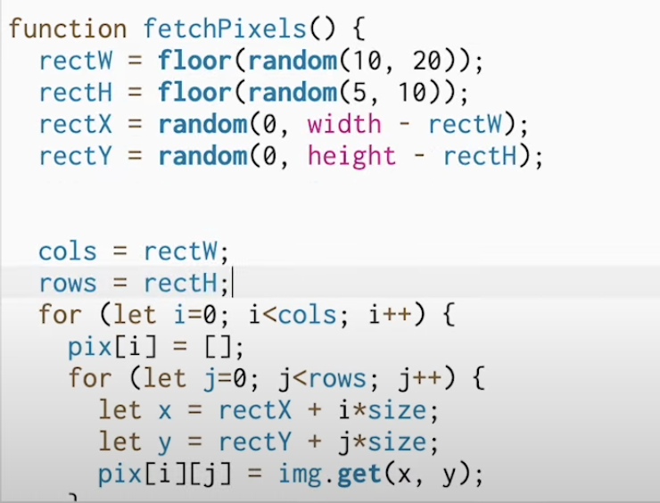

# Quiz-8

## Part 1: Imaging Technique Inspiration

I was mainly inspired by **Nkem Odeh-Ifeyinwa**'s "_Incognita II_" series, which presents the theme of "_Things are not always what they seem_" by **pixelating** the faces of people.I want to incorporate this expression method into my project because the assignment requirements are mainly for interactive effects and we choose the painting "Scream". I think through this effect, a certain part of the character in my painting can be **pixelated** to **highlight** this part, and then the theme can be expressed through the rendering of this part.


## Part 2: Coding Technique Exploration

I mainly use **p5.js**, which is a feature-rich **JavaScript tool library**. It provides functions such as image loading, layer drawing and interactive response, enabling me to quickly achieve visual effects such as **pixel decomposition and animation transformation**. For example, it provides **p5.sound reference**, which enables me to quickly complete the **input, analysis and synthesis of sounds**.

```
// Initiate the FFT object
  var fft = new p5.FFT();

  // Run the analysis, while the audio is playing
  fft.analyze();

  // Get different values for different frequency ranges
  // -----------------------------------------------------
  // p5.sound comes with predefined keywords,
  // but giving getEnergy() 2 numbers instead of a keyword
  // you could use your custom range if needed
  var bass    = fft.getEnergy( "bass" );
  var treble  = fft.getEnergy( "treble" );
  var mid     = fft.getEnergy( "mid" );
  var custom  = fft.getEnergy( 100, 200 );
```

code from [the link of code block](https://tympanus.net/codrops/2018/03/06/creative-audio-visualizers/)



code from [the code link of part of pixel effects](https://www.youtube.com/watch?v=FIvHnnOJ-7o)
